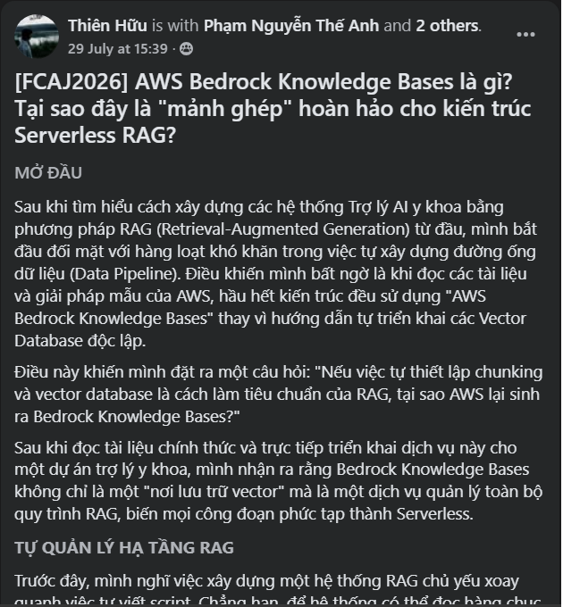
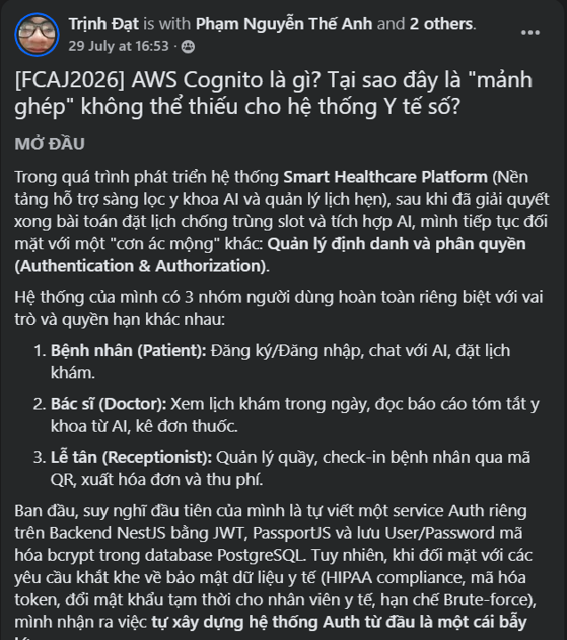
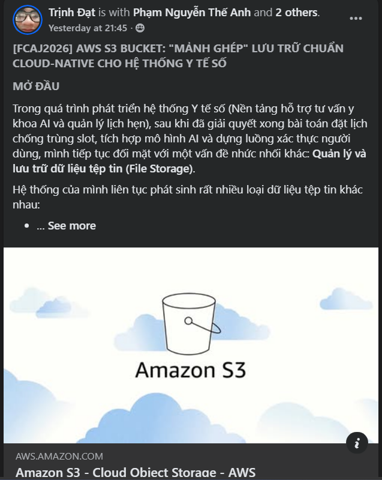

Phần này sẽ tổng hợp và giới thiệu các bài blog bạn đã đăng trên [AWS Study Group](https://www.facebook.com/groups/awsstudygroupfcj). Ví dụ:

# Các bài blog trên AWS Study Group

Kho lưu trữ này bao gồm bộ sưu tập các bài blog mà tôi đã xuất bản trên AWS Study Group, tập trung vào kiến trúc cloud-native, các giải pháp serverless, bảo mật và việc ứng dụng các dịch vụ AWS vào các hệ thống chăm sóc sức khỏe trong thực tế.

### [Blog 1 - AWS Bedrock Knowledge Bases: Mảnh ghép "còn thiếu" hoàn hảo cho kiến trúc Serverless RAG](3-BlogsPosted/3.1-Blog1)

Bài viết này giới thiệu **AWS Bedrock Knowledge Bases**, một dịch vụ tự động hóa toàn bộ quy trình RAG, bao gồm chia nhỏ tài liệu (document chunking), tạo embedding và lập chỉ mục vector mà không yêu cầu nhà phát triển phải quản lý hạ tầng cơ sở dữ liệu vector phức tạp. Bằng cách áp dụng kiến trúc Serverless RAG, hệ thống Medical AI Assistant có thể mở rộng linh hoạt đồng thời tự động đồng bộ tri thức mới từ Amazon S3.

### [Blog 2 - AWS Cognito: Mảnh ghép "không thể thiếu" cho hệ thống chăm sóc sức khỏe số](3-BlogsPosted/3.2-Blog2)

Bài viết này trình bày cách giải quyết bài toán xác thực và phân quyền đa vai trò cho một nền tảng chăm sóc sức khỏe số hỗ trợ Bệnh nhân, Bác sĩ và Nhân viên lễ tân. Thông qua việc tích hợp **AWS Cognito**, hệ thống tận dụng dịch vụ quản lý danh tính được AWS quản lý hoàn toàn, cơ chế phân quyền dựa trên vai trò (RBAC) bằng JWT token và quy trình đăng ký người dùng an toàn nhằm bảo vệ dữ liệu y tế nhạy cảm đồng thời giảm thiểu chi phí vận hành.

### [Blog 3 - AWS S3 Bucket: Mảnh ghép lưu trữ Cloud-Native cho hệ thống chăm sóc sức khỏe số](3-BlogsPosted/3.3-Blog3)

Bài viết chia sẻ kinh nghiệm di chuyển việc lưu trữ tệp—bao gồm hình ảnh y tế, chứng chỉ và các tệp trọng số của mô hình AI—từ máy chủ cục bộ lên **Amazon S3**. Việc sử dụng S3 giúp xây dựng kiến trúc backend stateless, đơn giản hóa quá trình mở rộng theo chiều ngang và nâng cao tính bảo mật của dữ liệu y tế nhạy cảm thông qua việc sử dụng Presigned URL.

