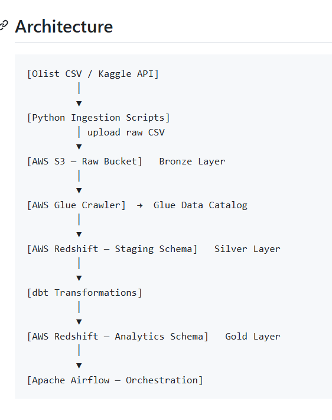

## 1. Workshop Objectives

After completing this workshop, you will be able to:

- Design a data pipeline based on the **ELT (Extract - Load - Transform)** architecture.
- Integrate **Apache Airflow** to orchestrate the entire workflow automatically.
- Use **dbt Core** to build data layers, including **Staging**, **Intermediate**, and **Data Marts**.
- Apply advanced **Data Quality Testing** techniques, such as detecting fanout join issues and validating data integrity.

---

## 2. System Architecture

The data pipeline in this project is organized as follows:

---

## 3. Key Components

| Component | Role in the System |
|-----------|--------------------|
| PostgreSQL | OLTP database that stores transactional data, including orders, products, and customers. |
| Amazon S3 | Data Lake for storing raw data in CSV and Parquet formats. |
| Amazon Redshift | Cloud data warehouse used to store staging tables and Data Mart models. |
| dbt Core | Performs data transformations, modeling, indexing, layer organization, and data quality testing. |
| Apache Airflow | Schedules, orchestrates, and monitors the entire data pipeline. |