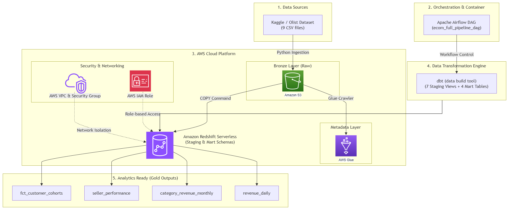
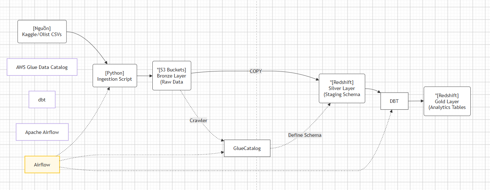

## 1. Mục tiêu chi tiết

Phần mở đầu này trình bày mục tiêu kỹ thuật cụ thể mà quá trình triển khai hướng đến, làm cơ sở để đánh giá mức độ hoàn thành của toàn bộ hệ thống ở phần kết luận. Sau khi hoàn tất quá trình triển khai được trình bày trong chương này, hệ thống đạt được các năng lực sau:

- Vận hành một pipeline dữ liệu hoàn chỉnh theo kiến trúc **ELT (Extract - Load - Transform)**, trong đó dữ liệu được trích xuất từ nguồn, nạp thẳng vào kho dữ liệu, và chỉ được biến đổi sau khi đã nằm trong kho dữ liệu, thay vì biến đổi ở tầng trung gian như kiến trúc ETL truyền thống.
- Tự động hóa toàn bộ chuỗi tác vụ - từ thu thập dữ liệu, nạp dữ liệu, biến đổi dữ liệu, cho đến kiểm thử chất lượng dữ liệu - thông qua công cụ điều phối Apache Airflow, có khả năng thử lại (retry) khi gặp lỗi tạm thời và dừng pipeline khi phát hiện dữ liệu không đạt chất lượng.
- Tổ chức dữ liệu thành nhiều tầng xử lý rõ ràng bằng dbt Core, bao gồm tầng Staging (làm sạch và chuẩn hóa dữ liệu thô) và tầng Data Mart (tổng hợp dữ liệu phục vụ trực tiếp cho các câu hỏi nghiệp vụ cụ thể).
- Áp dụng các kỹ thuật kiểm thử chất lượng dữ liệu (Data Quality Testing) ở nhiều cấp độ khác nhau, từ kiểm tra tính duy nhất và tính toàn vẹn của khóa, kiểm tra miền giá trị hợp lệ, cho đến việc chủ động xử lý hiện tượng **fanout join** - một lỗi phổ biến khi thực hiện các phép join một-nhiều khiến kết quả tổng hợp bị nhân bản sai lệch.
- Cung cấp một tập hợp các bảng dữ liệu đầu ra (Data Mart) phản ánh đúng các chỉ số nghiệp vụ mà một nền tảng thương mại điện tử thực sự quan tâm: doanh thu theo ngày, doanh thu theo danh mục sản phẩm, hiệu suất của từng người bán, và tỷ lệ giữ chân khách hàng theo từng nhóm (cohort).

## 2. Kiến trúc tổng thể của hệ thống

Hệ thống được thiết kế theo mô hình kiến trúc phân tầng dữ liệu, thường được gọi là **kiến trúc Medallion (Bronze - Silver - Gold)**, kết hợp với cách tổ chức tầng quen thuộc trong dbt (Staging - Data Mart). Việc lựa chọn kiến trúc phân tầng thay vì xử lý dữ liệu trực tiếp từ nguồn sang bảng báo cáo xuất phát từ hai lý do chính: thứ nhất, tách biệt rõ ràng giữa dữ liệu thô (chưa qua xử lý, giữ nguyên để có thể truy vết và xử lý lại khi cần) và dữ liệu đã qua xử lý; thứ hai, giảm thiểu việc lặp lại cùng một logic biến đổi ở nhiều nơi, vì các phép biến đổi cơ bản chỉ cần thực hiện một lần ở tầng Staging rồi được tái sử dụng ở tầng Data Mart thông qua cơ chế `ref()` của dbt.

Luồng xử lý dữ liệu tổng thể của hệ thống được tóm tắt như sau:

Toàn bộ chuỗi xử lý trên được Apache Airflow điều phối tự động theo lịch hằng ngày, đảm bảo dữ liệu trong kho luôn được cập nhật mà không cần can thiệp thủ công.

## 3. Vai trò của từng thành phần công nghệ trong hệ thống

Bảng dưới đây trình bày vai trò cụ thể của từng thành phần công nghệ được sử dụng trong hệ thống. So với bản mô tả ban đầu, bảng này đã được hiệu chỉnh lại cho đúng với cấu hình thực tế của dự án: hệ thống không sử dụng một cơ sở dữ liệu PostgreSQL độc lập làm nguồn dữ liệu giao dịch (OLTP), mà lấy dữ liệu trực tiếp từ bộ dữ liệu Olist thông qua Kaggle API; PostgreSQL trong hệ thống chỉ đóng vai trò là cơ sở dữ liệu metadata nội bộ phục vụ riêng cho Apache Airflow.

| Thành phần | Vai trò trong hệ thống |
|-----------|--------------------|
| Bộ dữ liệu Olist (Kaggle) | Nguồn dữ liệu gốc, mô phỏng dữ liệu giao dịch thực tế của một nền tảng thương mại điện tử, bao gồm đơn hàng, sản phẩm, người bán, khách hàng, thanh toán và đánh giá. |
| Script ingestion (Python, boto3, pandas) | Tải dữ liệu từ Kaggle, thực hiện kiểm tra hợp lệ sơ bộ (số dòng, số cột, tỷ lệ giá trị rỗng) và tải lên Amazon S3 theo cấu trúc phân vùng theo ngày. |
| Amazon S3 | Đóng vai trò Data Lake, lưu trữ dữ liệu thô (Raw Bucket, tương ứng tầng Bronze) và dữ liệu đã qua xử lý trung gian (Processed Bucket, tương ứng tầng Silver) dưới định dạng CSV. |
| AWS Glue Crawler & Glue Data Catalog | Tự động quét và nhận diện cấu trúc (schema) của dữ liệu thô trên S3, phục vụ nhu cầu truy vấn ad-hoc thông qua Amazon Athena mà không cần nạp dữ liệu vào Redshift, độc lập với luồng xử lý chính. |
| Amazon Redshift Serverless | Kho dữ liệu đám mây (Cloud Data Warehouse), lưu trữ cả schema Staging (dữ liệu đã nạp nhưng chưa biến đổi sâu) và schema Analytics (chứa các bảng Data Mart phục vụ báo cáo). |
| dbt Core | Thực hiện toàn bộ logic biến đổi dữ liệu, quản lý phiên bản mô hình dữ liệu, tổ chức phân tầng Staging/Data Mart, và thực thi các bài kiểm thử chất lượng dữ liệu. |
| Apache Airflow | Điều phối, lập lịch và giám sát toàn bộ pipeline; PostgreSQL đi kèm trong Airflow chỉ phục vụ lưu trữ metadata nội bộ của Airflow (lịch sử chạy DAG, trạng thái task), không liên quan đến dữ liệu nghiệp vụ. |
| Terraform | Quản lý hạ tầng AWS dưới dạng mã nguồn (Infrastructure as Code), đảm bảo hạ tầng có thể được khởi tạo lại một cách nhất quán giữa các môi trường (dev/prod). |
| Docker & Docker Compose | Đóng gói toàn bộ môi trường chạy Airflow và các thành phần phụ trợ, đảm bảo tính nhất quán giữa máy phát triển cục bộ và môi trường triển khai thực tế. |

## 4. Nhận xét về lựa chọn kiến trúc

So với phương án sử dụng một cơ sở dữ liệu OLTP trung gian trước khi đưa dữ liệu vào kho, cách tiếp cận lấy dữ liệu trực tiếp từ nguồn (Kaggle) và nạp thẳng lên S3 giúp đơn giản hóa đáng kể hạ tầng cần vận hành, đồng thời phù hợp với đặc điểm của bộ dữ liệu Olist - vốn là dữ liệu tĩnh, được công bố theo dạng tệp CSV chứ không phải một hệ thống giao dịch đang hoạt động liên tục. Trong một hệ thống thương mại điện tử thực tế có cơ sở dữ liệu giao dịch đang vận hành, tầng ingestion sẽ cần được thay thế bằng cơ chế trích xuất tăng trưởng (incremental extraction) từ cơ sở dữ liệu OLTP gốc, ví dụ thông qua Change Data Capture (CDC) hoặc truy vấn theo mốc thời gian cập nhật gần nhất; đây cũng là một hướng mở rộng hợp lý cho dự án trong giai đoạn tiếp theo.

Việc bổ sung AWS Glue Crawler song song với luồng nạp dữ liệu vào Redshift cũng là một điểm đáng chú ý trong thiết kế: hai đường dữ liệu này độc lập với nhau và phục vụ hai mục đích khác nhau - Redshift phục vụ các truy vấn phân tích có cấu trúc, tần suất cao, đòi hỏi hiệu năng tốt cho tầng Data Mart; trong khi Glue Data Catalog cùng Amazon Athena phục vụ nhu cầu truy vấn khám phá (exploratory query) trực tiếp trên dữ liệu thô mà không phát sinh chi phí nạp dữ liệu, phù hợp cho các tình huống cần kiểm tra nhanh dữ liệu gốc trước khi quyết định có đưa vào luồng xử lý chính hay không.