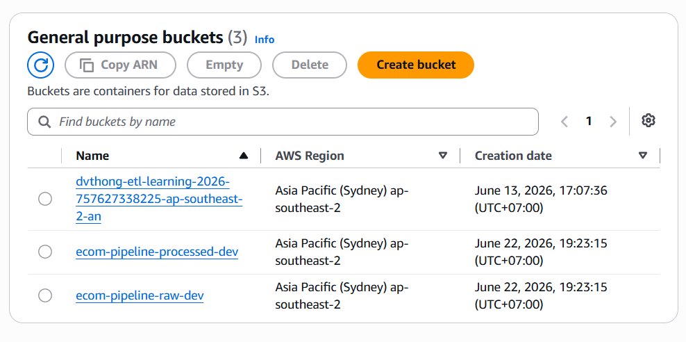
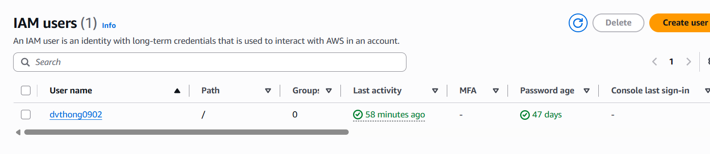

title: "5.2 - Chuẩn bị môi trường triển khai"
date: 2026-07-21
weight: 2
chapter: false
pre: " <b> 5.2. </b> "
---

Trước khi tiến hành triển khai các thành phần chính của hệ thống, nhóm đã chuẩn bị đầy đủ môi trường làm việc, bao gồm cấu hình phần cứng, tài khoản dịch vụ đám mây AWS, môi trường container hóa và bộ công cụ lập trình. Phần này trình bày lại toàn bộ quá trình chuẩn bị đó, cùng với những lưu ý phát sinh trong thực tế triển khai.

## 1. Cấu hình phần cứng sử dụng

Do hệ thống cần chạy đồng thời nhiều container Docker (Airflow Webserver, Airflow Scheduler, PostgreSQL nội bộ của Airflow) trong khi vẫn phải duy trì kết nối liên tục đến các dịch vụ AWS ở phía đám mây, cấu hình phần cứng của máy trạm phát triển được xác định dựa trên yêu cầu tối thiểu để Airflow hoạt động ổn định, cộng thêm một khoảng dự phòng cho các tác vụ dbt chạy song song. Cấu hình cụ thể được ghi nhận như sau:

| Thành phần | Cấu hình tối thiểu | Cấu hình khuyến nghị (thực tế sử dụng) |
| :--- | :--- | :--- |
| **Hệ điều hành** | Windows 10/11 Pro/Enterprise (WSL2), macOS 12+, Ubuntu 20.04 LTS | Windows 11 Pro (WSL2), macOS Apple Silicon (M1/M2/M3), Ubuntu 22.04 LTS |
| **CPU** | 4 Core / 8 Luồng | 8 Core / 16 Luồng |
| **Bộ nhớ RAM** | 8 GB | 16 GB trở lên (Airflow kết hợp dbt tiêu tốn RAM đáng kể khi chạy nhiều model song song) |
| **Dung lượng đĩa trống** | 20 GB SSD | 50 GB NVMe SSD (do dữ liệu Olist tải về cục bộ và các image Docker chiếm nhiều dung lượng) |

Trong quá trình triển khai thực tế, mức RAM 8 GB cho thấy sự hạn chế rõ rệt khi Airflow Scheduler, Airflow Webserver và tiến trình dbt cùng hoạt động; do đó mức 16 GB được khuyến nghị áp dụng ngay từ đầu thay vì chỉ xem là tùy chọn nâng cao.

## 2. Tài khoản AWS và cấu hình phân quyền IAM

Hệ thống sử dụng hai dịch vụ hạ tầng cốt lõi của AWS là **Amazon S3** và **Amazon Redshift Serverless**, bên cạnh đó là **AWS Glue** cho mục đích lập danh mục dữ liệu (data cataloging). Việc chuẩn bị tài khoản và phân quyền được thực hiện theo hai lớp riêng biệt: (1) quyền của người vận hành, dùng để khởi tạo và quản lý tài nguyên trong quá trình triển khai; và (2) quyền thực thi của dịch vụ (service role), dùng để các dịch vụ AWS tự động thao tác với nhau khi pipeline chạy. Việc tách bạch hai lớp quyền này là một thực hành quan trọng trong thiết kế bảo mật, tránh tình trạng cấp quyền quá rộng cho các tiến trình tự động.

### 2.1. Tài khoản AWS và IAM User của người vận hành

- Tài khoản AWS đã được xác thực thanh toán và ở trạng thái hoạt động (Active), có quyền truy cập vào **AWS Management Console**.
- Một IAM User riêng được khởi tạo dành cho quá trình triển khai (ví dụ: `data-pipeline-admin`), thay vì sử dụng tài khoản root cho các thao tác hằng ngày - đây là khuyến nghị bảo mật cơ bản của AWS.
- IAM User này được cấp hai chính sách quản lý (managed policy) ở mức đủ rộng để phục vụ việc khởi tạo tài nguyên trong giai đoạn triển khai: `AmazonS3FullAccess` và `AmazonRedshiftFullAccess`. Cần lưu ý rằng đây là phạm vi quyền phù hợp cho một tài khoản vận hành/triển khai trong môi trường thực hành; đối với môi trường sản xuất thực tế, phạm vi quyền này nên được thu hẹp lại theo nguyên tắc đặc quyền tối thiểu (least privilege), chỉ cấp đúng những hành động cần thiết trên đúng phạm vi tài nguyên (bucket, cluster) liên quan đến dự án.
- Một cặp **Access Key ID** và **Secret Access Key** dạng Programmatic Access được khởi tạo cho IAM User này, phục vụ việc xác thực từ AWS CLI và từ các script Python sử dụng trong quá trình kiểm tra thủ công.

### 2.2. Vai trò thực thi (IAM Role) dành riêng cho Amazon Redshift

Khác với IAM User ở trên (dùng để con người thao tác), hệ thống còn định nghĩa một **IAM Role** riêng để Amazon Redshift Serverless có thể tự động đọc dữ liệu từ Amazon S3 khi thực thi câu lệnh `COPY`. Vai trò này được quản lý thông qua Terraform (`infrastructure/terraform/main.tf`) chứ không cấu hình thủ công qua console, nhằm đảm bảo tính nhất quán và có thể tái lập giữa các môi trường. Điểm đáng chú ý là chính sách gắn với vai trò này được giới hạn phạm vi rất chặt, chỉ cho phép hai hành động `s3:GetObject` và `s3:ListBucket`, và chỉ trên đúng hai bucket phục vụ dự án (`raw` và `processed`) - hoàn toàn khác với quyền `AmazonS3FullAccess` cấp cho IAM User ở mục 2.1. Đây là ví dụ cụ thể cho việc áp dụng nguyên tắc đặc quyền tối thiểu ngay trong hạ tầng: con người có thể cần quyền rộng để thao tác linh hoạt trong lúc xây dựng hệ thống, nhưng dịch vụ chạy tự động (Redshift) thì chỉ nên có đúng quyền cần dùng khi vận hành.

### 2.3. Cấu hình tài nguyên đám mây ban đầu

Hai loại tài nguyên đám mây cốt lõi được chuẩn bị trước khi bước vào giai đoạn triển khai chi tiết ở phần 5.3:

1. **Amazon S3 Bucket** - Hai bucket được dự kiến khởi tạo theo quy ước đặt tên thống nhất trong toàn dự án: bucket chứa dữ liệu thô (`ecom-pipeline-raw-dev`) và bucket chứa dữ liệu đã qua xử lý trung gian (`ecom-pipeline-processed-dev`), cùng nằm trong khu vực (Region) `ap-southeast-2` để đảm bảo độ trễ truy cập thấp và tránh phát sinh chi phí truyền dữ liệu giữa các Region. Cấu hình **Block all public access** được giữ nguyên trạng thái bật cho cả hai bucket ngay từ đầu.
2. **Amazon Redshift Serverless** - Thay vì khởi tạo một cụm Redshift dạng Provisioned Cluster (yêu cầu lựa chọn loại node và số lượng node cố định), dự án lựa chọn mô hình **Redshift Serverless**, gồm một Namespace (nơi lưu trữ dữ liệu và cấu hình bảo mật) và một Workgroup (nơi định nghĩa năng lực tính toán, tính theo đơn vị RPU - Redshift Processing Unit). Việc lựa chọn mô hình Serverless giúp tránh phải ước lượng trước công suất cần thiết và tự động mở rộng theo tải thực tế, phù hợp với quy mô dữ liệu vừa phải của bộ dữ liệu Olist.


## 3. Môi trường container hóa (Docker)

Toàn bộ hệ thống được đóng gói và vận hành cục bộ thông qua Docker, nhằm đảm bảo tính nhất quán về môi trường chạy giữa các máy khác nhau và giảm thiểu sự khác biệt giữa môi trường phát triển và môi trường triển khai thực tế.

### 3.1. Cài đặt Docker Engine và Docker Compose

Docker Desktop được cài đặt trên Windows/macOS, hoặc Docker Engine kèm theo plugin `docker-compose-plugin` trên Linux. Phiên bản Docker Compose tối thiểu được yêu cầu là `v2.20.0`.

### 3.2. Các dịch vụ được định nghĩa trong `docker-compose.yml`

Tệp `docker-compose.yml` của dự án định nghĩa các dịch vụ chính sau, sử dụng image `apache/airflow:2.8.1-python3.11` làm nền tảng chung cho các thành phần liên quan đến Airflow:

1. **postgres** - Cơ sở dữ liệu PostgreSQL 15, đóng vai trò lưu trữ metadata nội bộ của Airflow (lịch sử DAG Run, trạng thái Task Instance), hoàn toàn tách biệt với dữ liệu nghiệp vụ của hệ thống.
2. **airflow-webserver** - Cung cấp giao diện quản trị (Web UI) tại cổng `8080`, có cấu hình health check định kỳ mỗi 30 giây.
3. **airflow-scheduler** - Quét thư mục DAGs, lập lịch và phân phối các task đến hàng đợi thực thi.
4. **airflow-init** - Dịch vụ chạy một lần khi khởi động lần đầu, thực hiện migrate cơ sở dữ liệu metadata và khởi tạo tài khoản quản trị mặc định cho Airflow Web UI.
5. **dbt** - Một service độc lập (đặt trong Docker Compose profile riêng tên `manual`, không tự khởi động cùng `docker compose up`), được dùng để chạy dbt một cách thủ công khi cần kiểm tra nhanh mà không phụ thuộc vào Airflow.

Các biến môi trường phục vụ kết nối AWS (`AWS_ACCESS_KEY_ID`, `AWS_SECRET_ACCESS_KEY`, `AWS_DEFAULT_REGION`) và kết nối Redshift (`REDSHIFT_HOST`, `REDSHIFT_PORT`, `REDSHIFT_DATABASE`, `REDSHIFT_USER`, `REDSHIFT_PASSWORD`) được truyền vào các container thông qua tệp `.env`, thay vì gán cứng trong mã nguồn.

**Lưu ý về bảo mật cấu hình:** trong quá trình rà soát tệp `docker-compose.yml` hiện tại của dự án, nhóm nhận thấy hai biến môi trường liên quan đến xác thực Kaggle (`KAGGLE_USERNAME`, `KAGGLE_KEY`) đang được khai báo trực tiếp dưới dạng giá trị cố định (hardcoded) ngay trong tệp cấu hình, thay vì được tham chiếu từ tệp `.env` như các biến còn lại. Đây là một điểm cần khắc phục trước khi đưa dự án lên môi trường chia sẻ công khai (ví dụ đẩy lên GitHub), vì thông tin xác thực bị lộ trong lịch sử commit sẽ không thể thu hồi bằng cách xóa đơn thuần. Hướng xử lý phù hợp là chuyển hai giá trị này vào tệp `.env` (đã được liệt kê trong `.gitignore`) hoặc sử dụng dịch vụ quản lý bí mật như AWS Secrets Manager, đồng thời thu hồi và cấp lại Kaggle API Key hiện tại.

## 4. Công cụ lập trình và quản lý cơ sở dữ liệu

### 4.1. Môi trường Python cục bộ

Python phiên bản `3.11` trở lên được cài đặt trên máy cục bộ để phục vụ phát triển các script trong thư mục `ingestion/` và chạy dbt CLI trực tiếp khi cần kiểm thử nhanh mà không thông qua container. Bộ thư viện chính được liệt kê trong `requirements.txt` của dự án, bao gồm `boto3`, `pandas`, `redshift-connector`, `dbt-core`, `dbt-redshift` và `kaggle`. Gói dbt dành riêng cho Redshift được cài đặt như sau:

```bash
pip install dbt-core==1.7.3 dbt-redshift==1.7.1
```

### 4.2. Visual Studio Code và các tiện ích mở rộng

Visual Studio Code được sử dụng làm môi trường phát triển tích hợp (IDE) chính trong suốt quá trình triển khai, với các tiện ích mở rộng sau được cài đặt để hỗ trợ công việc:

- **Python (`ms-python.python`)** - hỗ trợ gợi ý mã nguồn (IntelliSense), kiểm tra lỗi cú pháp (linting) và gỡ lỗi (debug) cho các script Python trong thư mục `ingestion/`.
- **dbt Power User (`innoverio.vscode-dbt-power-user`)** - hỗ trợ xem trước câu lệnh SQL đã được compile từ template Jinja, trực quan hóa sơ đồ phụ thuộc giữa các model (Lineage Graph), và cho phép chạy nhanh từng model dbt ngay trong IDE.
- **Docker (`ms-azuretools.vscode-docker`)** - quản lý container, image và theo dõi log trực tiếp trong IDE thay vì phải chuyển qua terminal riêng.
- **YAML (`redhat.vscode-yaml`)** - kiểm tra cú pháp cho các tệp cấu hình dạng YAML trong dự án như `docker-compose.yml`, `profiles.yml`, `dbt_project.yml` và các tệp `schema.yml`.

## 5. Kiểm tra mức độ sẵn sàng trước khi triển khai

Trước khi chuyển sang giai đoạn triển khai chi tiết ở phần 5.3, toàn bộ các hạng mục dưới đây đã được xác nhận hoàn thành. Bảng kiểm tra này cũng được sử dụng như một bằng chứng cho thấy môi trường đã sẵn sàng trước khi bắt đầu khởi tạo tài nguyên AWS thực tế.

| STT | Hạng mục kiểm tra | Lệnh xác minh / Thao tác | Kết quả |
| :-- | :--- | :--- | :--- |
| 1 | Docker Engine và Docker Compose đã cài đặt đúng phiên bản | `docker --version` và `docker compose version` | Đạt yêu cầu |
| 2 | Toàn bộ container của dự án khởi động thành công | `docker ps` hiển thị đầy đủ container Airflow và PostgreSQL đang ở trạng thái running | Đạt yêu cầu |
| 3 | IAM User xác thực thành công với AWS CLI | `aws sts get-caller-identity` trả về đúng thông tin IAM User đã tạo | Đạt yêu cầu |
| 4 | Kết nối đến Amazon S3 Bucket thành công | `aws s3 ls s3://<tên-bucket>` thực thi không phát sinh lỗi | Đạt yêu cầu |
| 5 | dbt CLI cài đặt đúng phiên bản | `dbt --version` hiển thị đầy đủ phiên bản `dbt-core` và `dbt-redshift` | Đạt yêu cầu |
| 6 | Giao diện quản trị Airflow truy cập được | Đăng nhập thành công tại `http://localhost:8080` | Đạt yêu cầu |


