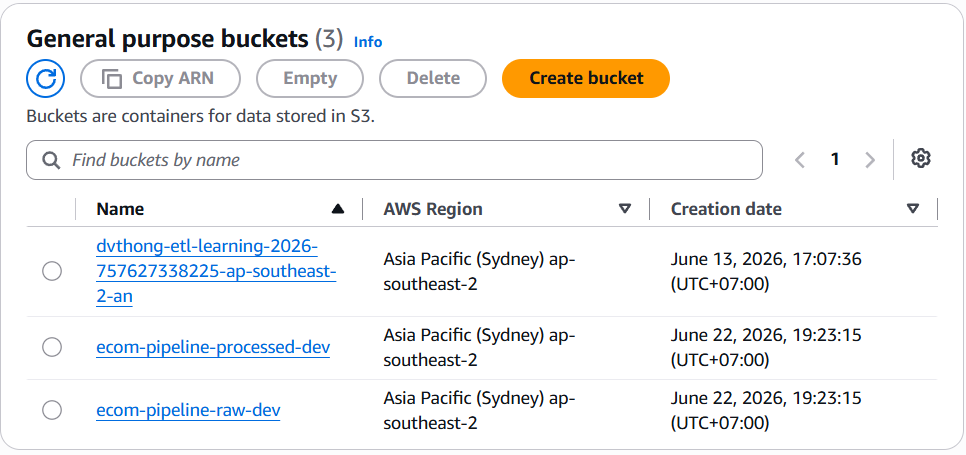
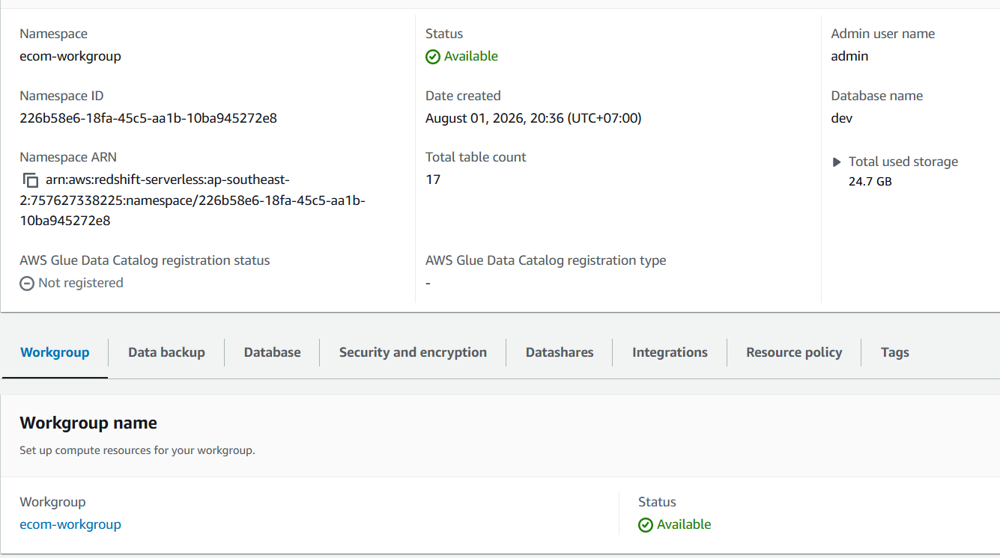

This section describes three deployment tasks performed in sequence: provisioning the Amazon S3 buckets, creating the Amazon Redshift Serverless data warehouse, and configuring a Gateway VPC Endpoint to establish private connectivity between the two services. In the actual project, these resources are primarily managed through Terraform (`infrastructure/terraform/main.tf`). The following walkthrough demonstrates the equivalent steps using the AWS Management Console for illustration purposes and to facilitate comparison with the Infrastructure as Code implementation.

## Step 1: Create Amazon S3 Buckets for the Raw Data Storage Layer

Following the project's naming convention (using the prefix `ecom-pipeline` and an environment-specific suffix), two S3 buckets are created:

1. Open the **Amazon S3 Console** and select **Create bucket**.
2. Create the first bucket named `ecom-pipeline-raw-prod`, representing the **Bronze** layer. This bucket stores the original CSV files downloaded from Kaggle and uploaded by the `ingestion/ingest_olist_to_s3.py` script using the partition structure:

   ```
   olist/year=<year>/month=<month>/day=<day>/
   ```

3. Select the **ap-southeast-2** AWS Region, matching both the default `aws_region` variable defined in Terraform and the ingestion scripts.
4. Keep **Block all public access** enabled. Since the bucket contains transactional data, public access must remain disabled at all times.
5. Enable **Bucket Versioning** during bucket creation to allow recovery of previous object versions if the ingestion process accidentally overwrites existing data.
6. Repeat the same process to create a second bucket named `ecom-pipeline-processed-prod`, representing the **Silver** layer. This bucket is intended to store intermediate processed data before it is loaded into Amazon Redshift.

After both buckets have been created, a **Lifecycle Configuration** is applied to the **Raw** bucket for all objects under the `olist/` prefix:

- After **90 days**, objects are automatically transitioned to the **S3 Intelligent-Tiering** storage class to reduce storage costs for infrequently accessed data.
- After **365 days**, objects automatically expire and are permanently deleted.

This lifecycle policy aligns well with the characteristics of the Olist dataset, where most analytical workloads focus on recent partitions, while historical ingestion snapshots are rarely accessed.



---

## Step 2: Create Amazon Redshift Serverless

Unlike a traditional provisioned Redshift cluster—which requires selecting fixed node types such as `dc2.large` or `ra3.xlplus`—Amazon Redshift Serverless is organized into two separate resources:

- **Namespace**, which manages databases, schemas, users, and security settings.
- **Workgroup**, which provides the compute resources.

This separation allows multiple Workgroups with different compute capacities to share the same Namespace, although this project uses only a single Workgroup.

1. Open the **Amazon Redshift Console**, navigate to **Redshift Serverless**, and select **Create workgroup**.
2. Create a Namespace named `ecom-pipeline-ns-prod` with:
   - Default database: `dev`
   - Administrator username: `admin`
   - A password meeting AWS complexity requirements (minimum eight characters including uppercase letters, lowercase letters, and numbers).
3. Attach the IAM Role previously provisioned by Terraform (`ecom-pipeline-redshift-s3-prod`). This enables Amazon Redshift to read data directly from the S3 buckets created in Step 1 without requiring AWS access keys.
4. Create a Workgroup named `ecom-pipeline-wg-prod` with a **base capacity of 8 RPUs (Redshift Processing Units)**, which is the minimum configuration suitable for development and can be increased later as query workloads grow.
5. During network configuration:
   - Disable **Turn on publicly accessible**.
   - Select the private subnets within the project's VPC.
   - Attach the dedicated Redshift security group (`ecom-pipeline-redshift-sg-prod`).

   This security group allows inbound traffic only on port **5439** from the VPC's internal CIDR ranges and does not expose the database to the public Internet.

Once the Workgroup reaches the **Available** state, create the two schemas required for the subsequent implementation stages by executing the following SQL statements in **Redshift Query Editor v2**:

```sql
CREATE SCHEMA staging;
CREATE SCHEMA mart;
```

The `staging` schema corresponds to the **Silver** layer, where raw data loaded through the `COPY` command is temporarily stored before dbt transformations.

The `mart` schema represents the **Gold** layer, containing business-ready Data Mart tables used for reporting and analytics.



---

## Step 3: Configure a Gateway VPC Endpoint for Amazon S3

This is the most important step in Section 5.3.1. It establishes a private network path that allows Amazon Redshift Serverless—configured with `publicly_accessible = false` in Step 2—to access the S3 buckets created in Step 1 without traversing either the public Internet or a NAT Gateway.

1. Open the **Amazon VPC Console**, select **Endpoints** from the left navigation pane, and choose **Create endpoint**.
2. Assign a descriptive name such as `ecom-pipeline-s3-gateway-endpoint`.
3. Under **Service category**, choose **AWS services**.
4. Search for `s3` and select the service whose **Type** is **Gateway** (not **Interface**). The service name follows the format:

   ```
   com.amazonaws.ap-southeast-2.s3
   ```

   A Gateway Endpoint is chosen because it incurs no hourly or per-GB processing charges. Instead, it operates by adding routes to the VPC Route Tables and is specifically designed for Amazon S3 and Amazon DynamoDB.

5. Select the VPC where the Amazon Redshift Serverless Workgroup is deployed.
6. Under **Route tables**, select all Route Tables associated with the private subnets hosting the Redshift Workgroup.

   This step determines which subnets are allowed to access Amazon S3 through the private endpoint. Any subnet whose Route Table is omitted will not be able to use the Gateway Endpoint.

7. Under **Policy**, keep the default **Full access** policy during the initial deployment to simplify testing.

   In Section 5.5, this policy will be replaced with a more restrictive version that grants access only to the project's two S3 buckets, following the principle of least privilege.

8. Choose **Create endpoint** to complete the configuration.

After the endpoint reaches the **Available** state, AWS automatically adds a new route to each selected Route Table. The destination is the Amazon S3 prefix list for the **ap-southeast-2** Region, while the target is the newly created Gateway VPC Endpoint.

From this point onward, all traffic originating from the selected private subnets and destined for Amazon S3 is automatically routed through the AWS private backbone network instead of the public Internet, without requiring any changes to the Redshift configuration or application code.