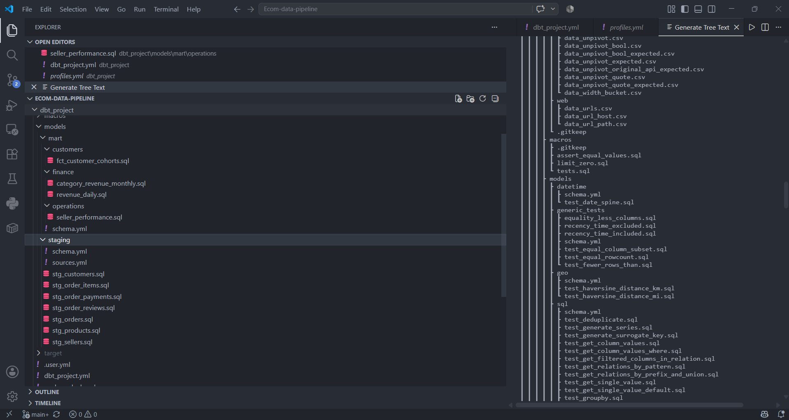

This section presents two sequential stages of the ELT workflow. First, raw data is loaded from Amazon S3 into the `staging` schema of Amazon Redshift. Second, **dbt Core** transforms these raw tables into a collection of **Staging Models**, which serve as the single source of truth referenced by all Data Mart models in Section 5.4.2 through dbt's `ref()` function.

Separating these two steps—loading raw data without modification and then performing transformations entirely within the data warehouse—captures the essence of the ELT architecture introduced in Section 5.1. Amazon Redshift, rather than an external processing layer, is responsible for all transformation logic.

## 1. Loading Raw Data into Amazon Redshift Using the `COPY` Command

Data loading is fully automated through the script `ingestion/load_to_redshift.py`, which is executed by the Airflow task `load_staging_to_redshift` (described in Section 5.4.3).

Instead of reading CSV files row by row and performing individual inserts, the script leverages Amazon Redshift's native **`COPY`** command. This is the most efficient loading mechanism because it takes advantage of Redshift's massively parallel processing (MPP) architecture to read data directly from Amazon S3 across multiple compute nodes simultaneously.

All eight raw tables are centrally defined as a collection of **`TableSpec`** Python dataclass objects. Each specification includes:

- Source CSV filename
- Destination table name
- Column mapping
- `CREATE TABLE` statement
- Optional distribution key (`DISTKEY`)
- Optional sort key (`SORTKEY`)

This design allows new source tables to be added simply by defining another `TableSpec`, without modifying the loading logic.

```python
# ingestion/load_to_redshift.py
@dataclass
class TableSpec:
    """Defines how each CSV maps to a Redshift table."""
    csv_file: str
    table_name: str
    columns: str
    ddl: str
    sort_key: Optional[str] = None
    dist_key: Optional[str] = None

TABLE_SPECS = [
    TableSpec(
        csv_file="olist_orders_dataset.csv",
        table_name="raw_orders",
        columns="order_id, customer_id, order_status, order_purchase_timestamp, "
                "order_approved_at, order_delivered_carrier_date, "
                "order_delivered_customer_date, order_estimated_delivery_date",
        sort_key="order_purchase_timestamp",
        dist_key="order_id",
        ddl="""
        CREATE TABLE IF NOT EXISTS {schema}.raw_orders (
            order_id                       VARCHAR(64) NOT NULL,
            customer_id                    VARCHAR(64),
            order_status                   VARCHAR(50),
            order_purchase_timestamp       TIMESTAMP,
            order_approved_at              TIMESTAMP,
            order_delivered_carrier_date   TIMESTAMP,
            order_delivered_customer_date  TIMESTAMP,
            order_estimated_delivery_date  TIMESTAMP,
            _loaded_at                     TIMESTAMP DEFAULT GETDATE()
        )
        DISTSTYLE KEY DISTKEY(order_id)
        SORTKEY(order_purchase_timestamp);
        """,
    ),
    # ... remaining TableSpec definitions
]
```

The following table summarizes the eight raw tables loaded into the `staging` schema.

| Destination Table | Source CSV | Distribution Strategy | Notes |
| :--- | :--- | :--- | :--- |
| `raw_orders` | `olist_orders_dataset.csv` | `DISTKEY(order_id)` | Sorted by `order_purchase_timestamp` to optimize time-based queries |
| `raw_order_items` | `olist_order_items_dataset.csv` | `DISTKEY(order_id)` | One row per order item |
| `raw_customers` | `olist_customers_dataset.csv` | `DISTKEY(customer_id)` | Distributed and sorted by customer identifier |
| `raw_sellers` | `olist_sellers_dataset.csv` | `DISTSTYLE ALL` | Small dimension table replicated across all nodes for faster joins |
| `raw_products` | `olist_products_dataset.csv` | `DISTSTYLE ALL` | Small dimension table |
| `raw_order_payments` | `olist_order_payments_dataset.csv` | `DISTKEY(order_id)` | Orders may contain multiple payment records |
| `raw_order_reviews` | `olist_order_reviews_dataset.csv` | `DISTKEY(order_id)` | Customer review information |
| `raw_category_translation` | `product_category_name_translation.csv` | `DISTSTYLE ALL` | Lookup table for Portuguese-to-English category translation |

Each table includes an additional metadata column:

```sql
_loaded_at TIMESTAMP DEFAULT GETDATE()
```

This column is referenced as `loaded_at_field` in `sources.yml`, enabling dbt freshness checks with:

- **Warning threshold:** 25 hours
- **Error threshold:** 49 hours

These thresholds intentionally exceed the daily pipeline schedule to avoid false alerts when a scheduled execution is delayed.

One notable design decision is that **`olist_geolocation_dataset.csv` is intentionally excluded** from the Redshift loading process.

Although this dataset is downloaded from Kaggle and uploaded to Amazon S3 by `ingestion/ingest_olist_to_s3.py`, it remains in the Bronze layer because:

- It is considerably larger than the other datasets.
- It is not directly required by the Data Mart models.
- It can instead be queried on demand using AWS Glue and Amazon Athena, as described in Section 5.1.

This avoids unnecessary Redshift storage and loading costs.

Each table is refreshed using a **TRUNCATE followed by COPY** strategy rather than incremental loading.

```python
def truncate_and_load(cursor, spec: TableSpec, s3_prefix: str, schema: str = STAGING_SCHEMA):
    table = f"{schema}.{spec.table_name}"
    s3_path = f"s3://{S3_BUCKET}/{s3_prefix}{spec.csv_file}"

    cursor.execute(spec.ddl.format(schema=schema))
    cursor.execute(f"TRUNCATE TABLE {table};")

    copy_sql = f"""
    COPY {table} ({spec.columns})
    FROM '{s3_path}'
    {_auth_clause()}
    REGION '{AWS_REGION}'
    FORMAT AS CSV
    QUOTE AS '"'
    IGNOREHEADER 1
    TIMEFORMAT 'auto'
    DATEFORMAT 'auto'
    BLANKSASNULL
    EMPTYASNULL
    MAXERROR 10;
    """
    cursor.execute(copy_sql)
```

Using **TRUNCATE + COPY** is appropriate because the Olist dataset is static and relatively small (slightly over 100,000 orders). Reloading the entire dataset each day is inexpensive while keeping the loading logic simple and deterministic.

The loading of all eight tables is executed within a single database transaction (`conn.autocommit = False`). If loading any table fails, `conn.rollback()` is executed so that the `staging` schema is never left in a partially updated state.

Authentication to Amazon S3 is handled through the `_auth_clause()` helper function, which prioritizes the IAM Role attached to the Redshift Namespace (configured in Section 5.3.1). Static AWS credentials are used only as a fallback. This implementation follows the principle of least privilege by allowing Redshift to assume temporary service credentials rather than embedding long-lived access keys.


---

## 2. Defining dbt Staging Models

Once the raw data has been loaded into the `staging` schema, dbt performs the remaining transformations that constitute the **Silver** layer. These transformations include:

- Standardizing data types
- Renaming columns using consistent conventions
- Filtering invalid records
- Computing derived columns that are reused throughout the Data Mart layer

The project defines **seven Staging Models**, located under `models/staging/` and following the naming convention `stg_<entity>`.

| Model | Source | Primary Transformations |
| :--- | :--- | :--- |
| `stg_customers` | `raw_customers` | Standardizes ZIP codes using `lpad`, capitalizes city names, converts state abbreviations to uppercase |
| `stg_sellers` | `raw_sellers` | Applies the same address normalization rules as `stg_customers` |
| `stg_order_items` | `raw_order_items` | Casts price and freight values to `DECIMAL(10,2)`, calculates `total_item_revenue`, removes negative values |
| `stg_order_payments` | `raw_order_payments` | Converts payment types to lowercase and removes negative payment amounts |
| `stg_order_reviews` | `raw_order_reviews` | Categorizes review scores as positive, neutral, or negative and computes `days_to_answer` |
| `stg_products` | `raw_products`, `raw_category_translation` | Joins product categories with their English translations and computes `volumetric_weight_g` |
| `stg_orders` | `raw_orders` | Normalizes order status, computes `is_delivered`, `is_late_delivery`, and delivery delay metrics |

Among these models, **`stg_orders`** contains the most significant business logic because many downstream Data Mart models reuse its derived fields.

```sql
-- models/staging/stg_orders.sql
with source as (
    select * from {{ source('olist_raw', 'raw_orders') }}
),
cleaned as (
    select
        order_id,
        customer_id,
        lower(trim(order_status)) as order_status,

        order_purchase_timestamp::timestamp as ordered_at,
        order_approved_at::timestamp as approved_at,
        order_delivered_carrier_date::timestamp as shipped_at,
        order_delivered_customer_date::timestamp as delivered_at,
        order_estimated_delivery_date::timestamp as estimated_delivery_at,

        date_trunc('day', order_purchase_timestamp)::date as order_date,
        date_trunc('week', order_purchase_timestamp)::date as order_week,
        date_trunc('month', order_purchase_timestamp)::date as order_month,

        case
            when lower(order_status) = 'delivered'
             and order_delivered_customer_date is not null
            then true else false
        end as is_delivered,

        case
            when order_delivered_customer_date is not null
             and order_estimated_delivery_date is not null
             and order_delivered_customer_date > order_estimated_delivery_date
            then true else false
        end as is_late_delivery,

        datediff('day',
                 order_estimated_delivery_date,
                 order_delivered_customer_date) as days_late,

        _loaded_at
    from source
    where order_id is not null
)
select * from cleaned
```

The derived columns `order_date`, `order_week`, and `order_month` are computed once in the staging layer so that every downstream Data Mart—including `revenue_daily`, `category_revenue_monthly`, and `fct_customer_cohorts`—uses a consistent definition of order time.

Similarly, the boolean flags `is_delivered` and `is_late_delivery` are defined centrally rather than being reimplemented repeatedly across multiple analytical models.

The **`stg_products`** model illustrates another common transformation pattern by combining multiple source tables into a single reusable dataset.

```sql
-- models/staging/stg_products.sql
with products as (
    select * from {{ source('olist_raw', 'raw_products') }}
),
translations as (
    select * from {{ source('olist_raw', 'raw_category_translation') }}
),
joined as (
    select
        p.product_id,
        coalesce(t.product_category_name_english, 'uncategorized') as category_en,
        p.product_category_name as category_pt,
        p.product_weight_g,
        p.product_length_cm,
        p.product_height_cm,
        p.product_width_cm,
        round(
            (p.product_length_cm * p.product_height_cm * p.product_width_cm) / 5.0,
            2
        ) as volumetric_weight_g
    from products p
    left join translations t
        on p.product_category_name = t.product_category_name
    where p.product_id is not null
)
select * from joined
```

Product category names are translated into English only once within `stg_products`, with missing translations defaulting to `'uncategorized'`. As a result, downstream models such as `category_revenue_monthly` simply reference this staging model without repeatedly joining the translation lookup table.

All seven Staging Models are materialized as **views** (`+materialized: view` in `dbt_project.yml`, discussed in Section 5.5) rather than physical tables.

This choice is appropriate because staging transformations consist primarily of lightweight operations such as type casting, column renaming, and row filtering. Using views eliminates duplicate storage while ensuring that staging models always reflect the most recent state of the underlying raw tables.

The trade-off is that each downstream query must recompute these transformations. However, given the project's modest data volume (just over 100,000 orders), this computational overhead is negligible compared with the benefits of simplicity and data freshness.

Each Staging Model is accompanied by basic data quality constraints defined in `schema.yml`. For example:

- `order_id` in `stg_orders` must satisfy both `unique` and `not_null` tests.
- `review_score` in `stg_order_reviews` is restricted to the valid domain `{1, 2, 3, 4, 5}`.

These tests form the first layer of the project's **Data Quality Testing** framework. The complete testing strategy and its automated execution within Apache Airflow are presented in Section 5.4.3.



