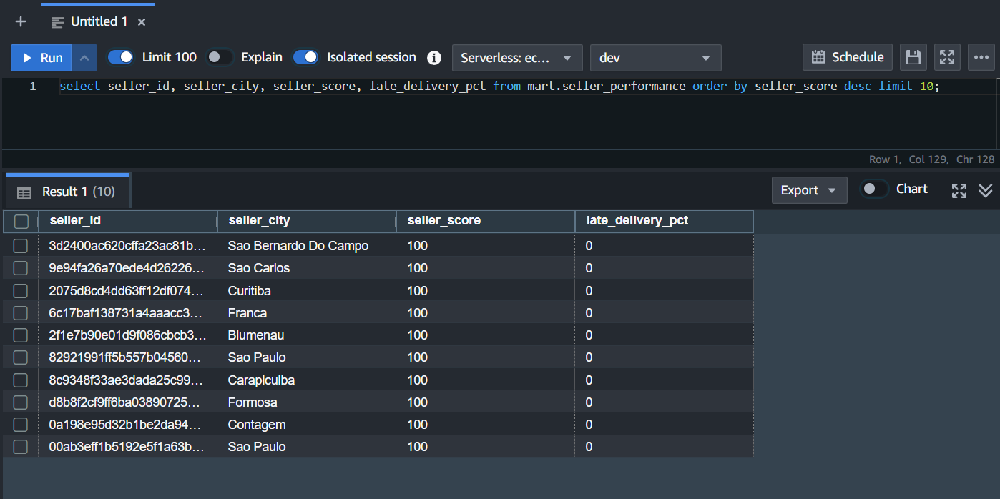
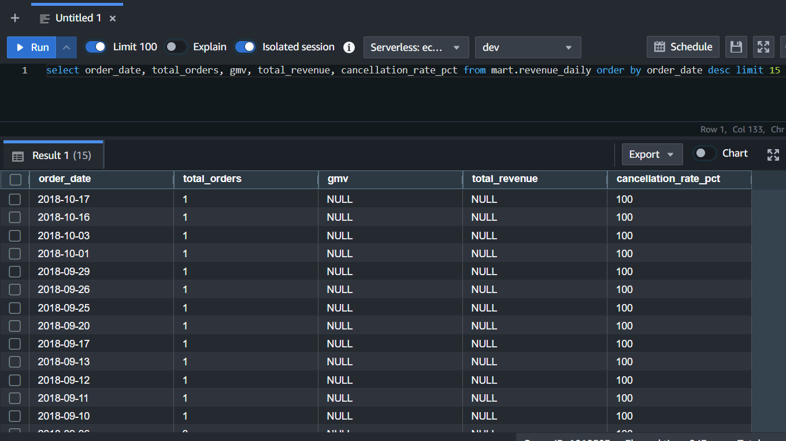

Nếu tầng Staging ở mục 5.4.1 có nhiệm vụ làm sạch và chuẩn hóa dữ liệu ở mức bản ghi, thì tầng Data Mart (tầng Gold) tổng hợp những dữ liệu đã sạch đó thành các bảng trả lời trực tiếp cho câu hỏi nghiệp vụ cụ thể. Đây là tầng dữ liệu mà các công cụ BI hoặc nhà phân tích sẽ truy vấn trực tiếp, nên mỗi model ở tầng này được vật chất hóa dưới dạng bảng (`+materialized: table`) thay vì view, nhằm đảm bảo tốc độ truy vấn ổn định và không phải tính toán lại logic tổng hợp mỗi lần có yêu cầu.

## 1. Tổ chức theo nhóm nghiệp vụ

Bốn Data Mart của dự án được chia vào ba thư mục con dưới `models/mart/`, tương ứng ba nhóm nghiệp vụ độc lập:

| Nhóm nghiệp vụ | Thư mục | Model | Câu hỏi nghiệp vụ trả lời |
| :--- | :--- | :--- | :--- |
| Tài chính | `mart/finance/` | `revenue_daily` | Doanh thu, số đơn, tỷ lệ hủy đơn biến động thế nào theo từng ngày? |
| Tài chính | `mart/finance/` | `category_revenue_monthly` | Danh mục sản phẩm nào đóng góp doanh thu nhiều nhất mỗi tháng? |
| Khách hàng | `mart/customers/` | `fct_customer_cohorts` | Khách hàng mua lần đầu trong tháng X còn quay lại mua tiếp bao nhiêu ở các tháng sau? |
| Vận hành | `mart/operations/` | `seller_performance` | Người bán nào đang hoạt động tốt, người bán nào cần cải thiện giao hàng/chất lượng? |

Cách phân nhóm này không chỉ mang tính tổ chức thư mục, mà còn ánh xạ trực tiếp sang schema và tag được gán trong `dbt_project.yml` (trình bày đầy đủ ở mục 5.5), cho phép chạy chọn lọc từng nhóm bằng `dbt run --select mart.finance` khi cần, thay vì luôn phải chạy lại toàn bộ tầng Gold.

Cả bốn model đều tuân theo một mẫu thiết kế chung: các CTE (Common Table Expression) đầu vào chỉ `select * from {{ ref('stg_...') }}`, tiếp theo là một hoặc nhiều CTE tổng hợp trung gian, và kết thúc bằng một CTE `final` duy nhất được `select` ra. Cách viết này giúp mỗi bước biến đổi có thể đọc và kiểm tra độc lập, đồng thời hạn chế lỗi phổ biến nhất khi viết SQL phân tích: **fanout join** - hiện tượng số dòng bị nhân lên sai lệch khi JOIN các bảng có quan hệ một-nhiều mà không tổng hợp trước.

## 2. `revenue_daily` - Báo cáo doanh thu theo ngày

Model này có hạt dữ liệu (grain) là một dòng cho mỗi ngày (`order_date`), tổng hợp GMV (Gross Merchandise Value), doanh thu gộp phí vận chuyển, giá trị đơn hàng trung bình, tỷ lệ giao trễ và tỷ lệ hủy đơn.

```sql
-- models/mart/finance/revenue_daily.sql
{{
    config(
        materialized='table',
        sort='order_date',
        dist='order_date',
        tags=['mart', 'finance', 'daily']
    )
}}

with orders as (
    select * from {{ ref('stg_orders') }}
    where order_date >= '{{ var("start_date") }}'
),
items as (
    select * from {{ ref('stg_order_items') }}
),
payments as (
    select
        order_id,
        sum(payment_value)    as total_payment_value,
        max(payment_type)     as primary_payment_type
    from {{ ref('stg_order_payments') }}
    group by 1
),

order_revenue as (
    select
        o.order_id, o.order_date, o.order_status,
        o.is_delivered, o.is_late_delivery,
        sum(i.item_price)            as gmv,
        sum(i.freight_value)         as freight_revenue,
        sum(i.total_item_revenue)    as gross_revenue,
        count(i.order_item_id)       as item_count,
        p.total_payment_value,
        p.primary_payment_type
    from orders o
    left join items i    on o.order_id = i.order_id
    left join payments p on o.order_id = p.order_id
    group by 1, 2, 3, 4, 5, p.total_payment_value, p.primary_payment_type
),

daily_aggregated as (
    select
        order_date,
        count(distinct order_id)                                as total_orders,
        count(distinct case when is_delivered then order_id end) as delivered_orders,
        count(distinct case when order_status = 'canceled'
                             then order_id end)                  as canceled_orders,
        round(sum(gmv), 2)                                      as gmv,
        round(sum(gross_revenue), 2)                            as total_revenue,
        round(avg(gross_revenue), 2)                            as avg_order_value,
        round(100.0 * count(distinct case when is_late_delivery then order_id end)
              / nullif(count(distinct case when is_delivered then order_id end), 0), 2)
                                                                 as late_delivery_pct,
        round(100.0 * count(distinct case when order_status = 'canceled'
                                            then order_id end)
              / nullif(count(distinct order_id), 0), 2)         as cancellation_rate_pct,
        sum(item_count)                                         as total_items_sold,
        current_timestamp                                       as dbt_updated_at
    from order_revenue
    group by 1
)

select * from daily_aggregated
order by order_date
```

Điểm kỹ thuật quan trọng nhất của model này nằm ở cách xử lý quan hệ một-nhiều giữa đơn hàng và thanh toán. Trong dữ liệu Olist, một đơn hàng có thể được thanh toán qua nhiều dòng (ví dụ trả góp nhiều đợt), nên nếu JOIN trực tiếp bảng `stg_order_payments` vào cấp độ dòng của `stg_order_items` mà không tổng hợp trước, mỗi mặt hàng trong đơn sẽ bị nhân bản theo đúng số dòng thanh toán tương ứng - đây chính là hiện tượng fanout join đã nêu ở mục 5.1. Model giải quyết vấn đề này bằng cách tổng hợp `payments` về đúng một dòng cho mỗi `order_id` **trước khi** JOIN, sau đó gộp tiếp `items` về cấp độ đơn hàng trong CTE `order_revenue`. Kết quả là mỗi đơn hàng chỉ đóng góp đúng một dòng khi tính tổng doanh thu ở CTE `daily_aggregated`, bất kể đơn đó có bao nhiêu mặt hàng hay bao nhiêu lượt thanh toán.

## 3. `category_revenue_monthly` - Doanh thu theo danh mục sản phẩm

Model này có hạt dữ liệu là một dòng cho mỗi cặp (tháng, danh mục sản phẩm tiếng Anh), phục vụ câu hỏi "danh mục nào bán chạy nhất mỗi tháng":

```sql
-- models/mart/finance/category_revenue_monthly.sql
{{
    config(
        materialized='table',
        sort=['order_month', 'total_gmv'],
        tags=['mart', 'finance']
    )
}}

with items as (
    select * from {{ ref('stg_order_items') }}
),
orders as (
    select * from {{ ref('stg_orders') }}
    where order_date >= '{{ var("start_date") }}'
      and order_status not in ('canceled', 'unavailable')
),
products as (
    select * from {{ ref('stg_products') }}
),

joined as (
    select
        date_trunc('month', o.order_date)::date     as order_month,
        p.category_en,
        count(distinct o.order_id)                  as order_count,
        count(i.order_item_id)                      as items_sold,
        round(sum(i.item_price), 2)                 as total_gmv,
        round(avg(i.item_price), 2)                 as avg_item_price
    from items i
    join orders o   on i.order_id  = o.order_id
    join products p on i.product_id = p.product_id
    group by 1, 2
),

ranked as (
    select
        *,
        rank() over (
            partition by order_month
            order by total_gmv desc
        )                       as revenue_rank_in_month,
        current_timestamp       as dbt_updated_at
    from joined
)

select * from ranked
```

Hai lựa chọn thiết kế đáng chú ý ở model này. Thứ nhất, các đơn hàng ở trạng thái `canceled` hoặc `unavailable` bị loại khỏi CTE `orders` ngay từ đầu, vì mục tiêu của báo cáo là phản ánh doanh thu **thực nhận theo danh mục**, không phải doanh thu dự kiến trên các đơn chưa hoàn tất hoặc đã hủy - khác với `revenue_daily`, nơi các đơn hủy vẫn được giữ lại để tính tỷ lệ hủy đơn. Thứ hai, hàm cửa sổ `rank() over (partition by order_month order by total_gmv desc)` tính sẵn thứ hạng doanh thu của từng danh mục trong mỗi tháng, giúp truy vấn "top 5 danh mục bán chạy nhất tháng này" chỉ cần lọc `where revenue_rank_in_month <= 5` mà không phải tính lại xếp hạng ở phía BI.

## 4. `fct_customer_cohorts` - Phân tích cohort và tỷ lệ giữ chân khách hàng

Đây là model phức tạp nhất về mặt logic, triển khai phân tích cohort (cohort analysis) - kỹ thuật phổ biến trong phân tích thương mại điện tử để đo lường mức độ khách hàng quay lại mua hàng theo thời gian, tính từ tháng họ phát sinh đơn hàng đầu tiên (`cohort_month`).

Một điểm cần lưu ý về dữ liệu Olist: mỗi đơn hàng gắn với một `customer_id` là mã định danh **theo từng đơn**, trong khi `customer_unique_id` mới là mã định danh duy nhất cho một con người thực. Nếu tính cohort theo `customer_id`, hệ thống sẽ hiểu nhầm rằng một khách hàng quay lại mua lần hai luôn là "khách hàng mới", vì mỗi đơn hàng của họ mang một `customer_id` khác nhau. Vì vậy model bắt buộc phải quy đổi qua `customer_unique_id` ngay từ bước đầu tiên:

```sql
-- models/mart/customers/fct_customer_cohorts.sql
{{
    config(
        materialized='table',
        sort=['cohort_month', 'months_since_first_order'],
        dist='cohort_month',
        tags=['mart', 'customers', 'cohort']
    )
}}

with customers as (
    select * from {{ ref('stg_customers') }}
),
orders as (
    select * from {{ ref('stg_orders') }}
    where order_date >= '{{ var("start_date") }}'
      and order_status not in ('canceled', 'unavailable')
),

-- Quy đổi mỗi đơn hàng về đúng một khách hàng thực (customer_unique_id)
customer_orders as (
    select
        c.customer_unique_id,
        o.order_date,
        date_trunc('month', o.order_date)::date as order_month,
        o.order_id
    from orders o
    join customers c on o.customer_id = c.customer_id
),

-- Tháng phát sinh đơn hàng đầu tiên của mỗi khách hàng = cohort_month
first_orders as (
    select
        customer_unique_id,
        min(order_month) as cohort_month
    from customer_orders
    group by 1
),

-- Với mỗi lượt mua, tính số tháng đã trôi qua kể từ đơn hàng đầu tiên
customer_activity as (
    select
        co.customer_unique_id,
        fo.cohort_month,
        datediff('month', fo.cohort_month, co.order_month) as months_since_first_order
    from customer_orders co
    join first_orders fo on co.customer_unique_id = fo.customer_unique_id
),

cohort_sizes as (
    select cohort_month, count(distinct customer_unique_id) as cohort_size
    from first_orders
    group by 1
),

retention_counts as (
    select
        cohort_month, months_since_first_order,
        count(distinct customer_unique_id) as retained_customers
    from customer_activity
    group by 1, 2
),

final as (
    select
        rc.cohort_month,
        cs.cohort_size,
        rc.months_since_first_order,
        rc.retained_customers,
        round(100.0 * rc.retained_customers / cs.cohort_size, 2) as retention_rate_pct,
        current_timestamp as dbt_updated_at
    from retention_counts rc
    join cohort_sizes cs on rc.cohort_month = cs.cohort_month
    where rc.months_since_first_order <= 12
)

select * from final
order by cohort_month, months_since_first_order
```

Luồng xử lý gồm năm bước tổng hợp nối tiếp: xác định khách hàng thực cho mỗi đơn (`customer_orders`), xác định tháng cohort của từng khách hàng (`first_orders`), tính khoảng cách tháng giữa mỗi lượt mua và tháng cohort (`customer_activity`), rồi tách thành hai chiều đếm độc lập - tổng số khách hàng trong mỗi cohort (`cohort_sizes`) và số khách hàng còn hoạt động ở từng mốc tháng (`retention_counts`) - trước khi kết hợp lại thành tỷ lệ giữ chân (`retention_rate_pct`) ở CTE `final`. Kết quả được giới hạn trong 12 tháng đầu sau lần mua đầu tiên (`months_since_first_order <= 12`), đủ để dựng một bảng retention theo dạng ma trận cohort × tháng quen thuộc trong báo cáo thương mại điện tử.

## 5. `seller_performance` - Bảng điểm hiệu suất người bán

Model này tổng hợp ba khía cạnh hiệu suất của từng người bán - doanh thu, đánh giá của khách hàng, và chất lượng giao hàng - thành một chỉ số tổng hợp duy nhất, `seller_score`, trên thang điểm 0-100:

```sql
-- models/mart/operations/seller_performance.sql
{{
    config(
        materialized='table',
        dist='seller_id',
        tags=['mart', 'operations']
    )
}}

with sellers as (
    select * from {{ ref('stg_sellers') }}
),
items as (
    select * from {{ ref('stg_order_items') }}
),
orders as (
    select * from {{ ref('stg_orders') }}
    where order_date >= '{{ var("start_date") }}'
),
reviews as (
    select * from {{ ref('stg_order_reviews') }}
),

-- Doanh thu theo từng người bán
seller_revenue as (
    select
        i.seller_id,
        count(distinct i.order_id)     as total_orders,
        count(i.order_item_id)         as total_items_sold,
        round(sum(i.item_price), 2)    as total_gmv,
        round(avg(i.item_price), 2)    as avg_item_price,
        min(o.order_date)              as first_order_date,
        max(o.order_date)              as last_order_date
    from items i
    join orders o on i.order_id = o.order_id
    group by 1
),

-- Điểm đánh giá theo từng người bán
seller_reviews as (
    select
        i.seller_id,
        round(avg(r.review_score), 2)  as avg_review_score,
        count(distinct r.review_id)    as total_reviews,
        count(distinct case when r.sentiment = 'negative'
                             then r.review_id end) as negative_reviews
    from items i
    join reviews r on i.order_id = r.order_id
    group by 1
),

-- Chất lượng giao hàng theo từng người bán
seller_delivery as (
    select
        i.seller_id,
        count(distinct o.order_id) as delivered_orders,
        count(distinct case when o.is_late_delivery
                             then o.order_id end) as late_deliveries
    from items i
    join orders o on i.order_id = o.order_id
    where o.is_delivered = true
    group by 1
),

final as (
    select
        s.seller_id,
        s.city                                              as seller_city,
        s.state_code                                        as seller_state,

        coalesce(r.total_orders, 0)                         as total_orders,
        coalesce(r.total_gmv, 0)                             as total_gmv,

        coalesce(rv.avg_review_score, 0)                    as avg_review_score,
        coalesce(rv.total_reviews, 0)                       as total_reviews,
        round(100.0 * coalesce(rv.negative_reviews, 0)
              / nullif(coalesce(rv.total_reviews, 0), 0), 2) as negative_review_pct,

        round(100.0 * coalesce(d.late_deliveries, 0)
              / nullif(coalesce(d.delivered_orders, 0), 0), 2) as late_delivery_pct,

        -- Seller Score: trọng số 50% đánh giá khách hàng + 50% tỷ lệ giao đúng hạn
        round(
            (coalesce(rv.avg_review_score, 3) / 5.0 * 50)
            + (1.0 - coalesce(d.late_deliveries, 0)::float
                / nullif(coalesce(d.delivered_orders, 1), 0)) * 50,
            1
        )                                                    as seller_score,

        current_timestamp                                   as dbt_updated_at
    from sellers s
    left join seller_revenue  r  on s.seller_id = r.seller_id
    left join seller_reviews  rv on s.seller_id = rv.seller_id
    left join seller_delivery d  on s.seller_id = d.seller_id
)

select * from final
```

Model được xây dựng theo đúng mẫu thiết kế chung đã nêu ở mục 1: ba CTE tổng hợp độc lập (`seller_revenue`, `seller_reviews`, `seller_delivery`), mỗi CTE nhóm dữ liệu theo `seller_id` trước, sau đó mới `left join` cả ba vào bảng `sellers` ở CTE `final`. Nhờ tổng hợp trước theo `seller_id` ở từng nhánh, phép `left join` cuối cùng không tạo ra fanout dù `sellers` có quan hệ một-nhiều với cả đơn hàng, đánh giá lẫn lượt giao hàng.

Công thức tính `seller_score` gồm hai thành phần, mỗi thành phần đóng góp tối đa 50 điểm:

- **Điểm đánh giá khách hàng (50%):** điểm đánh giá trung bình trên thang 5, quy đổi tuyến tính sang thang 50 (`avg_review_score / 5.0 * 50`).
- **Điểm giao hàng đúng hạn (50%):** phần trăm đơn giao đúng hạn trong tổng số đơn đã giao, quy đổi sang thang 50 (`(1 - late_deliveries / delivered_orders) * 50`).

Một người bán đạt điểm đánh giá tuyệt đối và không có đơn giao trễ sẽ đạt `seller_score = 100`; điểm số giảm dần tương ứng khi đánh giá thấp hơn hoặc tỷ lệ giao trễ tăng lên. Với người bán chưa có đánh giá hoặc chưa có đơn nào được giao (trường hợp người bán mới), công thức dùng `coalesce(rv.avg_review_score, 3)` để mặc định về mức điểm trung tính (3/5) thay vì 0, và `nullif(..., 1)` để tránh chia cho 0 khi `delivered_orders` bằng 0 - nhờ vậy người bán mới vẫn nhận được một điểm khởi đầu hợp lý thay vì bị tính điểm 0 một cách bất công hoặc gây lỗi runtime. Ràng buộc `seller_score` phải nằm trong khoảng 0-100 được kiểm tra tự động bằng dbt test, trình bày ở mục 5.4.3.



