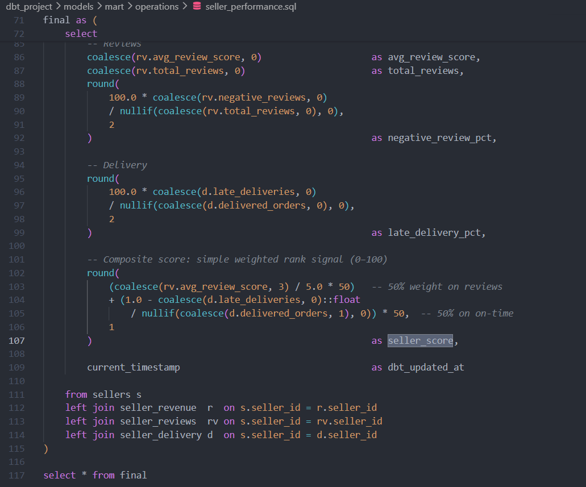

### Xây dựng Model `seller_performance.sql`

Model này tổng hợp hiệu suất của từng nhà bán hàng (doanh thu, điểm đánh giá, tỷ lệ giao hàng trễ, và điểm tổng hợp `seller_score` từ 0 - 100).

```sql
-- models/mart/operations/seller_performance.sql
{{
    config(
        materialized='table',
        dist='seller_id',
        tags=['mart', 'operations']
    )
}}

with sellers as (
    select * from {{ ref('stg_sellers') }}
),
items as (
    select * from {{ ref('stg_order_items') }}
),
orders as (
    select * from {{ ref('stg_orders') }}
    where order_date >= '{{ var("start_date") }}'
),
reviews as (
    select * from {{ ref('stg_order_reviews') }}
),

-- Khắc phục lỗi Fanout Join bằng COUNT DISTINCT order_id
seller_delivery as (
    select
        i.seller_id,
        count(distinct o.order_id) as delivered_orders,
        count(distinct case when o.is_late_delivery then o.order_id end) as late_deliveries
    from items i
    join orders o on i.order_id = o.order_id
    where o.is_delivered = true
    group by 1
),

final as (
    select
        s.seller_id,
        s.city as seller_city,
        -- Tính toán điểm chỉ số Seller Score (Thang điểm 0 - 100)
        round(
            (coalesce(rv.avg_review_score, 3) / 5.0 * 50) 
            + (1.0 - coalesce(d.late_deliveries, 0)::float 
                / nullif(coalesce(d.delivered_orders, 1), 0)) * 50,
            1
        ) as seller_score,
        current_timestamp as dbt_updated_at
    from sellers s
    left join seller_delivery d on s.seller_id = d.seller_id
    left join seller_reviews rv on s.seller_id = rv.seller_id
)

select * from final

