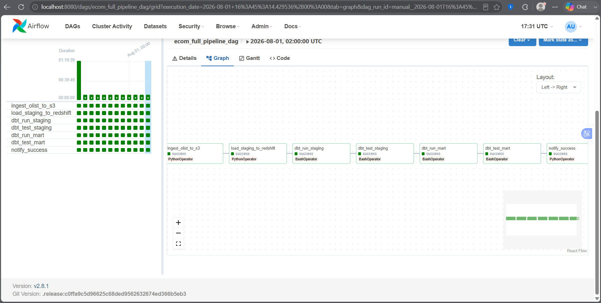
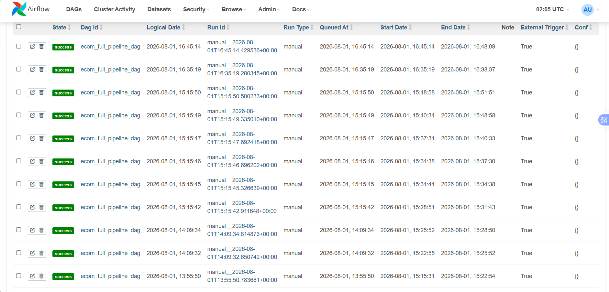

Hai mục 5.4.1 và 5.4.2 đã trình bày các thành phần xử lý dữ liệu riêng lẻ - script nạp dữ liệu, các Staging Model, các Data Mart. Mục này trình bày cách toàn bộ các thành phần đó được ghép lại thành một quy trình tự động, chạy theo lịch cố định và có khả năng tự dừng khi phát hiện dữ liệu không đạt chất lượng, thông qua DAG (Directed Acyclic Graph) duy nhất của dự án: `ecom_full_pipeline_dag`, định nghĩa tại `airflow/dags/ecom_full_pipeline_dag.py`.

## 1. Cấu trúc DAG và chuỗi tác vụ

DAG được cấu hình chạy tự động mỗi ngày một lần vào lúc 02:00 UTC (tương đương 09:00 giờ Việt Nam), không truy hồi (backfill) các lần chạy trong quá khứ khi được kích hoạt lần đầu, và chỉ cho phép tối đa một lần chạy hoạt động cùng lúc - tránh tình trạng một lần chạy bị trễ chồng lấn với lần chạy kế tiếp:

```python
with DAG(
    dag_id="ecom_full_pipeline_dag",
    description="Olist E-Commerce: S3 ingestion → Redshift → dbt transforms",
    schedule_interval="0 2 * * *",  # 02:00 UTC = 09:00 VN time
    start_date=datetime(2024, 1, 1),
    catchup=False,
    default_args=DEFAULT_ARGS,
    tags=["ecommerce", "olist", "dbt", "production"],
    doc_md=__doc__,
    max_active_runs=1,
) as dag:
```

Chính sách thử lại khi tác vụ thất bại được khai báo tập trung trong `DEFAULT_ARGS`, áp dụng đồng nhất cho cả bảy tác vụ: mỗi tác vụ được thử lại tối đa 2 lần, với thời gian chờ giữa các lần thử tăng dần theo cấp số nhân (exponential backoff) bắt đầu từ 5 phút và không vượt quá 30 phút:

```python
DEFAULT_ARGS = {
    "owner": "data-engineering",
    "depends_on_past": False,
    "email_on_failure": False,
    "email_on_retry": False,
    "retries": 2,
    "retry_delay": timedelta(minutes=5),
    "retry_exponential_backoff": True,
    "max_retry_delay": timedelta(minutes=30),
}
```

Bảy tác vụ của DAG được tóm tắt trong bảng sau, theo đúng thứ tự thực thi:

| STT | Task ID | Loại Operator | Vai trò |
| :-- | :--- | :--- | :--- |
| 1 | `ingest_olist_to_s3` | PythonOperator | Gọi hàm `ingest()` trong `ingestion/ingest_olist_to_s3.py`, tải dữ liệu Olist từ Kaggle và đẩy lên S3 |
| 2 | `load_staging_to_redshift` | PythonOperator | Gọi hàm `load_all()` trong `ingestion/load_to_redshift.py`, nạp dữ liệu từ S3 vào schema `staging` bằng lệnh `COPY` |
| 3 | `dbt_run_staging` | BashOperator | Chạy `dbt run --select staging`, vật chất hóa 7 Staging Model dưới dạng view |
| 4 | `dbt_test_staging` | BashOperator | Chạy `dbt test --select staging` - cổng kiểm soát chất lượng đầu tiên |
| 5 | `dbt_run_mart` | BashOperator | Chạy `dbt run --select mart`, vật chất hóa 4 Data Mart dưới dạng bảng |
| 6 | `dbt_test_mart` | BashOperator | Chạy `dbt test --select mart` - cổng kiểm soát chất lượng thứ hai |
| 7 | `notify_success` | PythonOperator | Ghi log xác nhận pipeline chạy thành công, chỉ thực thi khi cả sáu tác vụ trước đều `SUCCESS` |

Bốn tác vụ liên quan đến dbt (task 3-6) đều được thực thi bằng `BashOperator`, dùng chung một biến lệnh cơ sở:

```python
DBT_DIR = "/usr/app/dbt_project"
# Gọi trực tiếp lệnh dbt (đã truyền PATH trong DBT_ENV bên dưới)
DBT_CMD = f"cd {DBT_DIR} && dbt deps && dbt"

DBT_ENV = {
    # Thêm đường dẫn local bin của airflow vào PATH
    "PATH": f"/home/airflow/.local/bin:{os.environ.get('PATH', '')}",
    "DBT_PROFILES_DIR": DBT_DIR,
    "DBT_TARGET": "prod",
    **{
        k: os.environ.get(k, "")
        for k in [
            "REDSHIFT_HOST",
            "REDSHIFT_PORT",
            "REDSHIFT_DATABASE",
            "REDSHIFT_USER",
            "REDSHIFT_PASSWORD",
        ]
    },
}
```

Đường dẫn `/usr/app/dbt_project` chính là điểm mount volume `./dbt_project:/usr/app/dbt_project` đã khai báo trong `docker-compose.yml` (mục 5.2), giúp container Airflow nhìn thấy đúng mã nguồn dbt đang được phát triển trên máy host mà không cần đóng gói lại image. Biến `DBT_TARGET: "prod"` được truyền trực tiếp vào môi trường thực thi của mỗi lệnh `dbt`, quyết định `dbt` sử dụng khối cấu hình `prod` trong `profiles.yml` (schema `analytics`, 8 luồng xử lý song song) thay vì `dev` - đây chính là biến điều khiển hành vi của macro đặt tên schema trình bày ở mục 5.5. Với mỗi tác vụ dbt, câu lệnh cụ thể được ghép từ `DBT_CMD`, ví dụ tác vụ `dbt_run_staging` thực thi:

```
cd /usr/app/dbt_project && dbt deps && dbt run --select staging --target prod
```

Việc gọi lại `dbt deps` (cài đặt package `dbt_utils`, `audit_helper`) ở đầu mỗi tác vụ tuy có phần dư thừa về mặt thời gian chạy - vì bộ package không thay đổi giữa bốn tác vụ trong cùng một lần chạy DAG - nhưng đảm bảo mỗi tác vụ độc lập, tự đủ điều kiện để chạy mà không phụ thuộc trạng thái để lại từ tác vụ trước, phù hợp với triết lý thiết kế idempotent (có thể chạy lại nhiều lần cho cùng kết quả) thường được khuyến nghị cho các tác vụ Airflow.

Toàn bộ bảy tác vụ được nối với nhau theo một chuỗi tuyến tính duy nhất, không có nhánh song song:

```python
    #  Task Dependencies
    (
        ingest_task
        >> load_staging_task
        >> dbt_run_staging
        >> dbt_test_staging
        >> dbt_run_mart
        >> dbt_test_mart
        >> notify_task
    )
```

Điểm đáng chú ý nhất trong cách sắp xếp chuỗi này là vị trí của `dbt_test_staging`: kiểm thử tầng Staging được đặt **trước** `dbt_run_mart`, chứ không gộp việc kiểm thử toàn bộ pipeline vào cuối cùng. Thiết kế này hiện thực hóa nguyên tắc "fail fast" - nếu dữ liệu thô vừa nạp vào đã vi phạm ràng buộc (ví dụ trùng `order_id`, hoặc `order_status` xuất hiện giá trị lạ), DAG dừng lại ngay tại bước 4 và không tốn thời gian, tài nguyên tính toán để xây dựng các Data Mart ở bước 5 trên nền dữ liệu đã biết là có vấn đề.

Mỗi tác vụ đều gắn thêm `on_failure_callback=notify_failure`, một hàm Python ghi log chi tiết (task ID, DAG run ID, số lần thử, đường dẫn log) mỗi khi tác vụ thất bại sau khi đã thử lại hết số lần cho phép - đây là điểm có thể mở rộng thêm để gửi cảnh báo qua Slack hoặc email trong giai đoạn vận hành thực tế, hiện tại mới dừng ở mức ghi log.




## 2. Kiểm thử chất lượng dữ liệu (Data Quality Testing)

Hai tác vụ `dbt_test_staging` và `dbt_test_mart` không kiểm tra logic nghiệp vụ một cách tùy ý, mà thực thi tập hợp các ràng buộc được khai báo tường minh trong các tệp `schema.yml` đi kèm mỗi tầng model - đúng theo triết lý "kiểm thử là một phần của mã nguồn" của dbt, thay vì kiểm tra thủ công sau khi dữ liệu đã lên báo cáo.

Dự án sử dụng hai nhóm test. Nhóm thứ nhất là các generic test có sẵn của dbt Core: `unique`, `not_null`, và `accepted_values` (kiểm tra giá trị cột nằm trong một tập hợp cho phép). Nhóm thứ hai là `dbt_utils.expression_is_true`, một test đến từ package `dbt_utils` (đã khai báo ở `packages.yml`), cho phép kiểm tra một biểu thức điều kiện bất kỳ - đây là công cụ chính để diễn đạt các ràng buộc nghiệp vụ dạng số, ví dụ một tỷ lệ phần trăm phải nằm trong khoảng 0-100.

Bảng dưới đây liệt kê các ràng buộc quan trọng nhất đang được kiểm tra, tổng hợp từ `models/staging/schema.yml` và `models/mart/schema.yml`:

| Tầng | Model | Cột | Test | Ý nghĩa |
| :--- | :--- | :--- | :--- | :--- |
| Staging | `stg_orders` | `order_id` | `unique`, `not_null` | Mỗi đơn hàng chỉ được xuất hiện một lần |
| Staging | `stg_orders` | `order_status` | `accepted_values` | Trạng thái đơn chỉ nhận 1 trong 8 giá trị hợp lệ đã biết |
| Staging | `stg_order_items` | `item_price`, `freight_value` | `dbt_utils.expression_is_true: ">= 0"` | Giá và phí vận chuyển không được âm |
| Staging | `stg_customers`, `stg_sellers`, `stg_products` | khóa chính | `unique`, `not_null` | Đảm bảo tính duy nhất của các bảng chiều (dimension) |
| Staging | `stg_order_reviews` | `review_score` | `accepted_values: [1,2,3,4,5]` | Điểm đánh giá đúng thang 1-5 của Olist |
| Mart | `revenue_daily` | `order_date` | `unique`, `not_null` | Mỗi ngày chỉ có đúng một dòng báo cáo |
| Mart | `revenue_daily` | `gmv` | `dbt_utils.expression_is_true: ">= 0"` | GMV không thể âm |
| Mart | `revenue_daily` | `total_orders` | `dbt_utils.expression_is_true: "> 0"` | Mỗi ngày trong báo cáo phải có ít nhất một đơn hàng |
| Mart | `seller_performance` | `seller_id` | `unique`, `not_null` | Mỗi người bán chỉ có một dòng điểm hiệu suất |
| Mart | `seller_performance` | `seller_score` | `dbt_utils.expression_is_true: "between 0 and 100"` | Điểm hiệu suất phải nằm đúng thang đã thiết kế ở mục 5.4.2 |
| Mart | `fct_customer_cohorts` | `retention_rate_pct` | `dbt_utils.expression_is_true: "between 0 and 100"` | Tỷ lệ giữ chân là một tỷ lệ phần trăm hợp lệ |
| Mart | `fct_customer_cohorts` | `months_since_first_order` | `dbt_utils.expression_is_true: ">= 0"` | Không tồn tại mốc thời gian âm so với lần mua đầu |

Ngoài các test gắn trên Staging Model, các bảng thô (`raw_orders`, `raw_customers`, `raw_sellers`, `raw_products`, `raw_order_payments`, `raw_order_reviews`) cũng được gắn test tương tự (`unique`, `not_null`, `accepted_values`) ngay tại khai báo `source` trong `sources.yml` - nghĩa là một số ràng buộc dữ liệu được kiểm tra sớm nhất có thể, trước cả khi dữ liệu đi qua bất kỳ phép biến đổi nào của Staging Model. Tệp `sources.yml` còn khai báo ngưỡng kiểm tra độ mới của dữ liệu (`freshness`), cảnh báo nếu bảng thô không được nạp mới trong 25 giờ và báo lỗi nếu quá 49 giờ; tuy nhiên lệnh kiểm tra độ mới tương ứng (`dbt source freshness`) hiện chưa được khai báo thành một tác vụ riêng trong DAG, mà mới chỉ là một công cụ có sẵn có thể chạy thủ công. Đây là một hạng mục có thể bổ sung để hoàn thiện thêm chuỗi kiểm soát chất lượng tự động.

Khi một tác vụ `dbt test` chạy, dbt trả về kết quả tổng hợp dạng đếm theo bốn trạng thái - `PASS`, `WARN`, `ERROR`, `SKIP` - kèm tổng số test đã chạy, ví dụ định dạng đầu ra: `Done. PASS=12 WARN=0 ERROR=0 SKIP=0 TOTAL=12`. Bất kỳ test nào ở trạng thái `ERROR` khiến tiến trình `dbt` thoát với mã lỗi khác 0, `BashOperator` tương ứng trong Airflow ghi nhận tác vụ thất bại, kích hoạt cơ chế thử lại đã cấu hình ở `DEFAULT_ARGS`; nếu vẫn thất bại sau khi thử lại, toàn bộ các tác vụ phía sau (bao gồm `notify_success`) sẽ không được thực thi.

Một điểm kỹ thuật cần lưu ý khi diễn giải kết quả của cổng kiểm thử thứ hai (`dbt_test_mart`): do tác vụ `dbt_run_mart` chạy **trước** và vật chất hóa các Data Mart dưới dạng bảng thật (`materialized='table'`) bằng thao tác `CREATE TABLE AS` / thay thế bảng cũ, dữ liệu mới - kể cả khi chưa qua kiểm thử - đã được ghi vào schema `mart` ngay khi `dbt_run_mart` hoàn tất, tức là trước khi `dbt_test_mart` kịp chạy. Nói cách khác, việc `dbt_test_mart` báo lỗi sẽ dừng DAG và cảnh báo đội vận hành, nhưng không tự động "cuộn ngược" (rollback) để gỡ bỏ dữ liệu sai đã được ghi vào bảng `mart` ở bước trước đó. Trong phạm vi dự án hiện tại, điều này được chấp nhận vì DAG chỉ chạy tối đa một lần một ngày và có người giám sát log khi có cảnh báo; nếu triển khai ở quy mô lớn hơn với nhiều bên tiêu thụ dữ liệu mart trực tiếp, đây là điểm có thể cân nhắc áp dụng mẫu thiết kế Write-Audit-Publish (ghi vào bảng tạm, kiểm thử, rồi mới hoán đổi sang bảng chính thức) để đảm bảo dữ liệu chưa qua kiểm thử không bao giờ hiển thị cho người dùng cuối.

