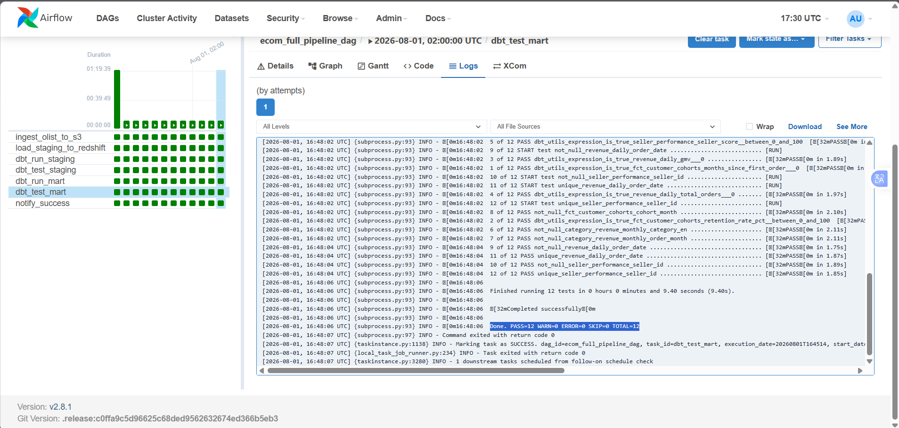

### 1. Cấu hình Airflow DAG (`ecom_full_pipeline_dag`)
Airflow chịu trách nhiệm thực thi chuỗi công việc:
1. `extract_postgres_to_s3`
2. `s3_to_redshift_staging`
3. `dbt_run_mart`
4. `dbt_test_mart`

### 2. Thực thi & Kiểm thử tính đúng đắn của dữ liệu

Thực hiện chạy `dbt test` để kiểm tra điều kiện dữ liệu (ví dụ: `seller_score` phải nằm trong khoảng từ `0` đến `100`).

