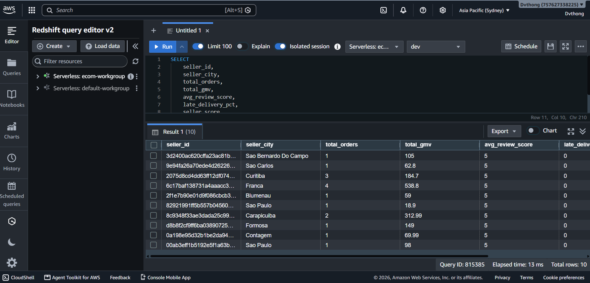

Sau khi Data Mart được dbt build thành công trên Redshift, tiến hành kiểm tra kết quả truy vấn phân tích.

### Truy vấn Top nhà bán hàng có chỉ số hoạt động cao nhất
```sql
SELECT 
    seller_id,
    seller_city,
    total_orders,
    total_gmv,
    avg_review_score,
    late_delivery_pct,
    seller_score
FROM mart.seller_performance
ORDER BY seller_score DESC
LIMIT 10;
