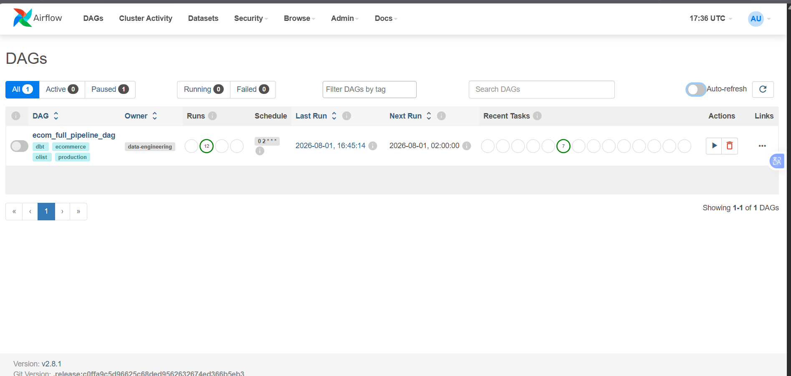

Để tránh phát sinh chi phí ngoài ý muốn trên AWS sau khi hoàn thành Workshop, hãy thực hiện dọn dẹp tài nguyên theo các bước sau:

### Bước 1: Tắt Airflow DAGs
Vào giao diện Airflow UI ➔ Chuyển trạng thái DAG `ecom_full_pipeline_dag` sang **OFF**.

---

### Bước 2: Xóa Amazon Redshift Cluster
1. Truy cập **Redshift Console** ➔ Chọn cluster `redshift-ecom-dw`.
2. Chọn **Actions** ➔ **Delete**.
3. Bỏ chọn "Create final snapshot" nếu không cần lưu lại ➔ Xác nhận xóa.

---

### Bước 3: Dọn dẹp S3 Bucket
1. Truy cập **S3 Console** ➔ Chọn bucket `ecom-raw-data-lake-prod`.
2. Nhấn **Empty** để xóa toàn bộ file chứa bên trong.
3. Chọn **Delete** để xóa bucket hoàn toàn.