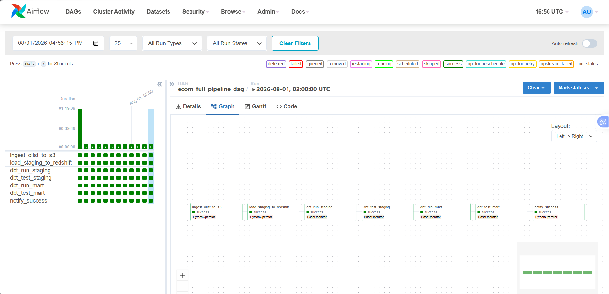

# Chapter 5: Deploying an E-Commerce Data Pipeline with Apache Airflow, dbt, and Amazon Redshift

## Introduction

As e-commerce businesses generate an increasingly large volume of transactional data every day, building a system capable of automatically collecting, storing, processing, and delivering data for analytics in a reliable and scalable manner has become an essential requirement. To address this need, this chapter presents the end-to-end implementation of a complete **Modern Data Stack (MDS)** solution named **ecom-data-pipeline**. The project is designed to simulate the data processing workflow of a medium-scale e-commerce platform, covering the entire pipeline from ingesting raw data to delivering transformed datasets that are ready for business reporting and analytics.

The dataset used throughout this chapter is the **Brazilian E-Commerce Public Dataset by Olist**, a real-world public dataset published on Kaggle. It contains more than 100,000 orders placed between 2016 and 2018 in Brazil, along with related information about customers, sellers, products, payments, and customer reviews. Using a realistic dataset with sufficient scale and multiple interconnected entities allows the implementation to closely reflect real-world data engineering scenarios, rather than serving as a purely theoretical example.

## Objectives and Scope

The primary objective of this chapter is to build a complete data pipeline following the **ELT (Extract – Load – Transform)** architecture. In this approach, raw data is first extracted and loaded directly into the data warehouse before transformation is performed within the warehouse itself using specialized tools. Unlike the traditional ETL architecture, where data is transformed before loading, ELT takes advantage of Amazon Redshift's massively parallel processing capabilities while enabling transformation logic to be centrally managed, version-controlled, and tested using dbt.

The following topics are covered in detail throughout this chapter:

- Design the overall system architecture using the **Bronze – Silver – Gold** layered approach, corresponding to the **Raw**, **Staging**, and **Data Mart** layers in dbt.

- Prepare the deployment environment, including hardware requirements, AWS cloud resources, and the necessary development tools.

- Deploy the raw data storage layer on **Amazon S3** and the data warehouse on **Amazon Redshift Serverless**, along with configuring a **Gateway VPC Endpoint** to establish private connectivity between resources within the VPC and Amazon S3.

- Build the data transformation layer using **dbt Core**, including Staging and Data Mart models, together with **Data Quality Testing**.

- Orchestrate the entire workflow using **Apache Airflow**, ensuring scheduled execution, automatic retries on failure, and execution monitoring.

- Standardize project configuration and governance for dbt to improve maintainability and scalability.

- Clean up cloud resources after completing the implementation to avoid unnecessary AWS costs.

This chapter focuses on the data infrastructure and transformation layers. Topics related to data visualization and business intelligence dashboards are outside the scope of this chapter. However, the Data Mart tables produced by the pipeline can be directly connected to popular BI tools such as **Amazon QuickSight**, **Microsoft Power BI**, or **Tableau** in the next phase of the project.

## Chapter Structure

This chapter is organized into six main sections, following the same sequence used during the actual implementation:

1. [System Overview](5.1-Workshop-overview/) – Introduces the project objectives, overall architecture, and the role of each technology component.

2. [Environment Preparation](5.2-Prerequiste/) – Describes the hardware requirements, AWS account setup, IAM permissions, and development tools.

3. [Deploying the Storage and Data Warehouse on AWS](5.3-S3-vpc/) – Covers the creation of Amazon S3, Amazon Redshift Serverless, and private connectivity using a Gateway VPC Endpoint.

4. [Building the Data Transformation Layer and Orchestrating the Pipeline](5.4-S3-onprem/) – Explains the implementation of dbt Staging and Data Mart models, Airflow DAG configuration, and analytical query results.

5. [Standardizing dbt Project Configuration and Governance](5.5-Policy/) – Describes the organization of the `dbt_project.yml` file, schema layering, and project naming conventions.

6. [Cleaning Up Resources](5.6-Cleanup/) – Presents the process of removing AWS resources after deployment and testing to minimize cloud costs.

